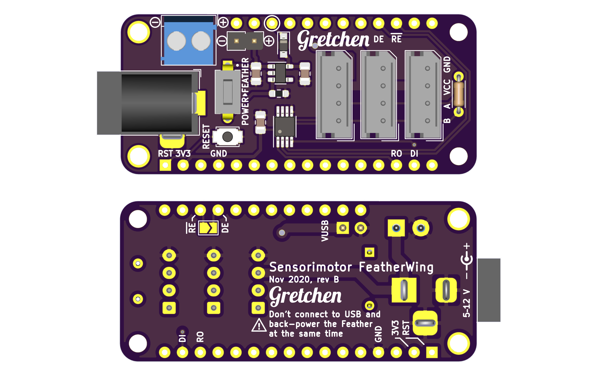
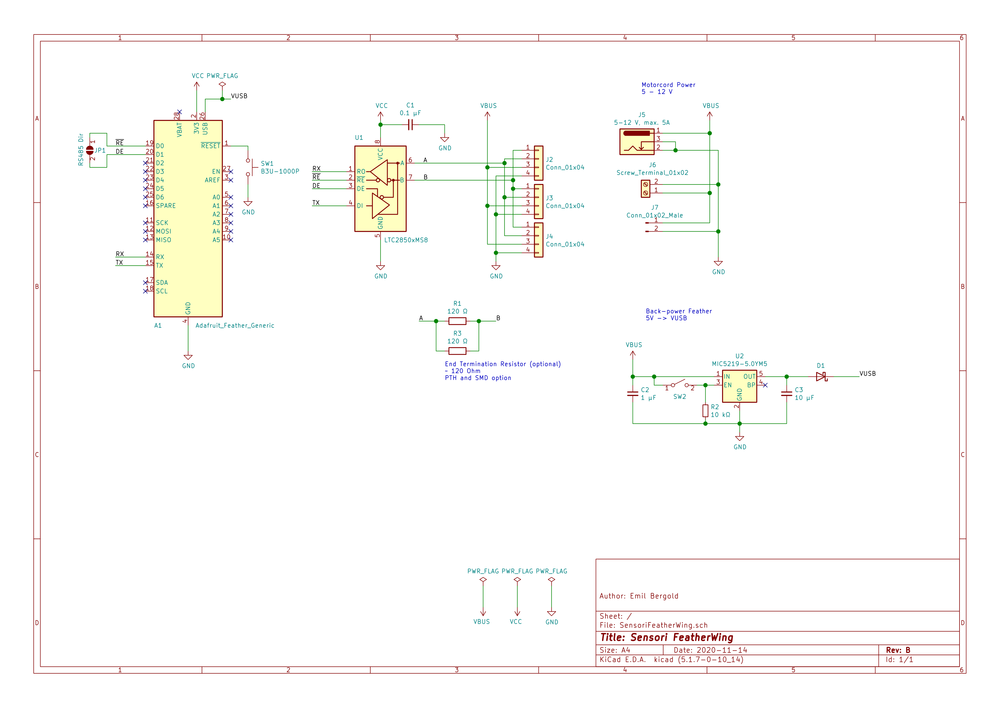

# Sensorimotor FeatherWing

This FeatherWing lets you connect your Feather to a RS-485 bus. It also provides various ways of providing power to your RS-485 bus system, as well as the ability to back-power the Feather from the bus.

The bus connector is compatible to the Sensorimotor system. (It's a 4-pin Molex Mini-SPOX)

**Warning**: Usually Feathers don’t have a reverse USB back-feed protection. You might damage your USB port when the „Power>Feather“ switch is on. So, always turn it off before connecting a USB cable to the Feather.

→ [KiCAD Files](https://github.com/bergold/Sensori-FeatherWing)

## Schematic

